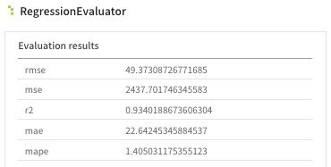
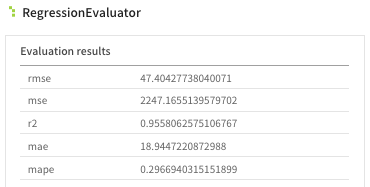
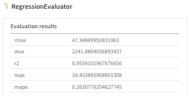
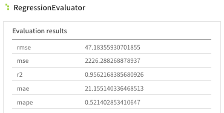
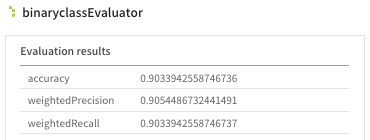
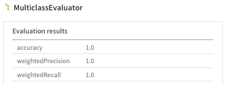
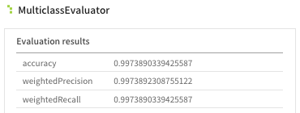

# ML modeler 알고리즘 사용법

> [목차](mlmodeler.md)
> ---
> 1. 알고리즘 목록
> 1. Parameter info
> 1. 예제 및 시나리오

 

1. 시나리오 리스트
    1. [자전거 수요 예측](bicycle.md)
    1. [발전량 예측](insolation.md)
    1. [식용 버섯 분류](mushroom.md)

 

- 발전량 예측 시나리오에 대한 회귀 모델 결과

| LinearRegression | RandomForestRegressor | DecisionTreeRegressor | GeneralizedLinearRegression |
|---|---|---|---|
|  |  |  |  |

 

- 식용 버섯 분류 시나리오에 대한 분류 모델 결과 

| LinearRegression | RandomForestClassifier | DecisionTreeClassifier |
|---|---|---|
|  |  |  |

 

- 고객 유형 군집화 결과

| KMeans | GaussianMixture |
|---|---|
|  |  |

 
